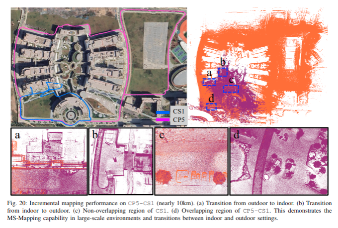
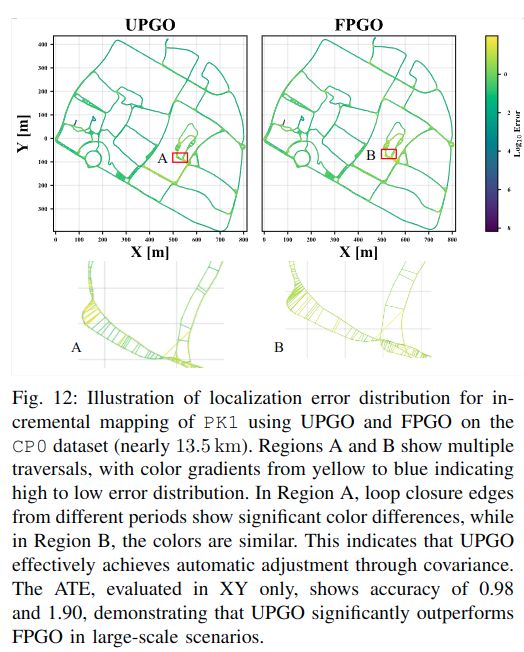
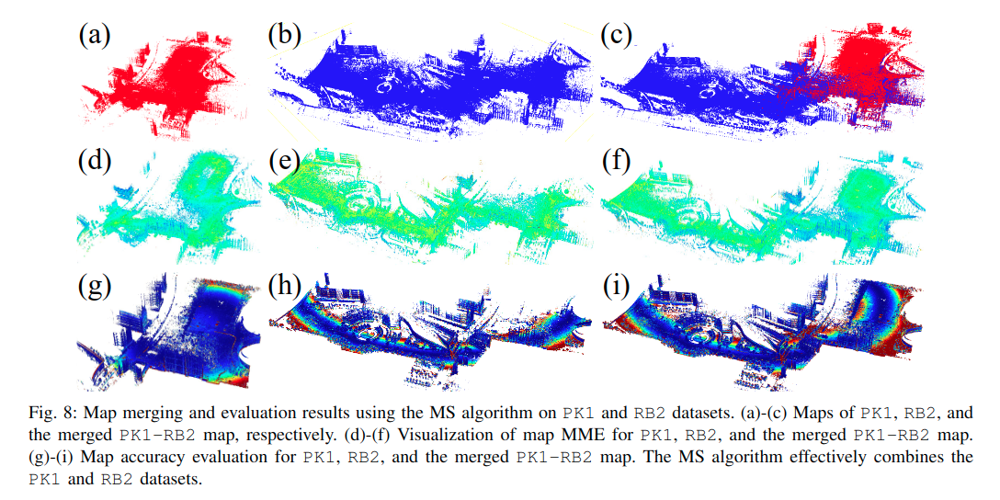

<div id="top" align="center">

# MS-Mapping: An Uncertainty-Aware Large-Scale Multi-Session LiDAR Mapping System




</div>

[](https://opensource.org/licenses/MIT)
[](https://github.com/JokerJohn/MS-Mapping/stargazers)
[](https://github.com/JokerJohn/MS-Mapping/issues)

## Table of Contents

- [Introduction](#introduction)
- [News](#news)
- [Dataset](#dataset)
- [Results](#results)
- [Citations](#citations)
- [License](#license)

## Introduction

**Author**: Xiangcheng Hu, Jin Wu, Jianhao Jiao, Binqian Jiang, Wei Zhang, Wenshuo Wang and Ping Tan

**MS-Mapping** presents a novel multi-session LiDAR mapping system that employs an incremental mapping scheme and flexibly supports various LiDAR-based odometry front-ends, enabling high-precision and consistent map assembly in large-scale environments. 

<div align="center">


</div>

## News

- **2024/06/03**: submit to a [workshop](https://arxiv.org/html/2406.02096v1).
- **2024/05/20**: submit to a journal.

## Dataset

### [Fusion Portable V2 Dataset](https://fusionportable.github.io/dataset/fusionportable_v2/)

Our algorithms were rigorously tested on the [Fusion Portable V2 Dataset](https://fusionportable.github.io/dataset/fusionportable_v2//). 

### Self-collected Dataset

### Adjustment


|  |  |
| ------------------------------------------------------------ | ------------------------------------------------------------ |
|                                                              |                                                              |


### Map Evaluation

|  |  |
| ------------------------------------------------------------ | ------------------------------------------------------------ |
|                                                              |                                                              |

<div align="center">


</div>


### Time Analysis

<div align="center">


</div>

To plot the results, you can follow this [scripts](https://github.com/JokerJohn/SLAMTools/blob/main/Run_Time_analysis/time_analysis.py).


## Citations

Please cite:
```
@misc{hu2024msmapping,
      title={MS-Mapping: Multi-session LiDAR Mapping with Wasserstein-based Keyframe Selection}, 
      author={Xiangcheng Hu, Jin Wu, Jianhao Jiao, Wei Zhang and Ping Tan},
      year={2024},
      eprint={2406.02096},
      archivePrefix={arXiv},
      primaryClass={cs.RO}
}
```

## License

This project's code is available under the [MIT LICENSE](./LICENSE).
