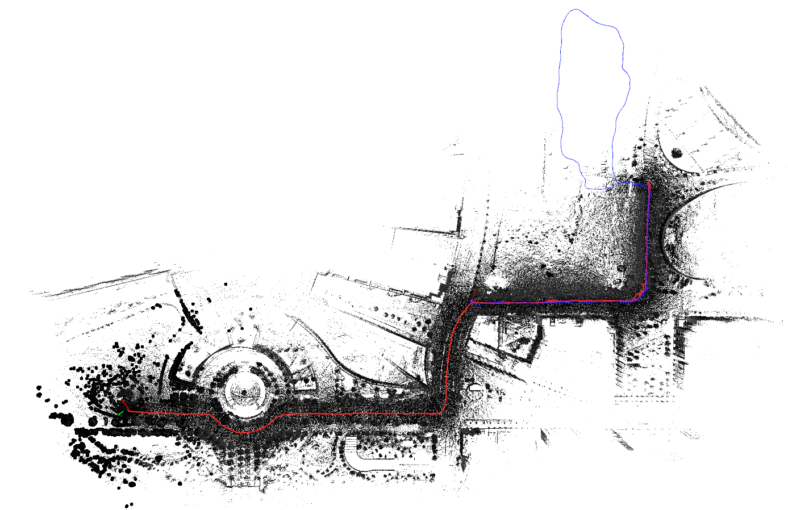
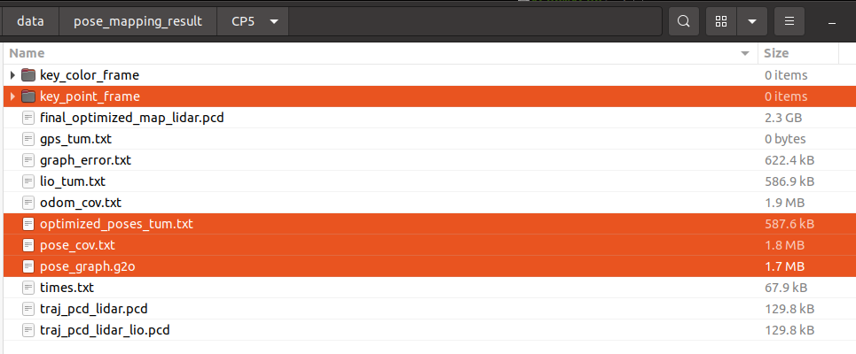
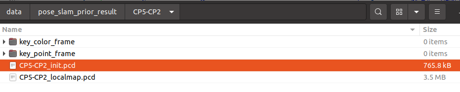
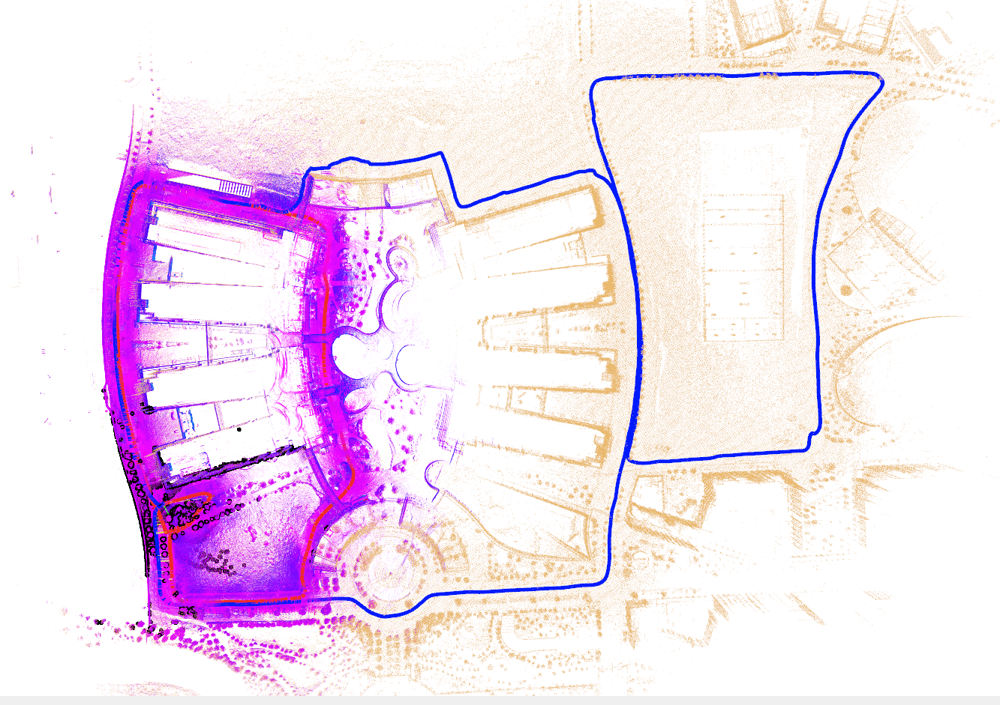
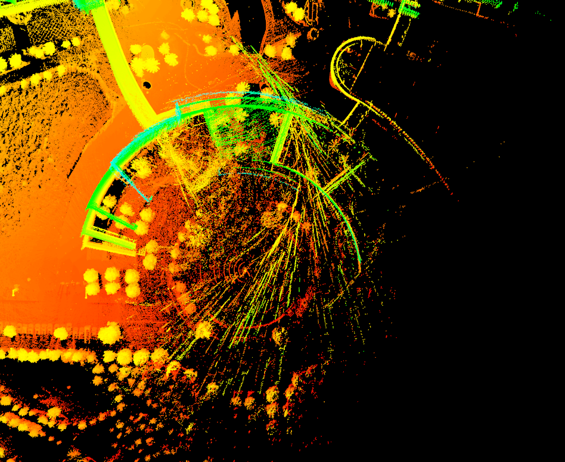

<div align="center">

<h1>MS-Mapping: An Uncertainty-Aware Large-Scale Multi-Session LiDAR Mapping System</h1>

[**Xiangcheng Hu**](https://github.com/JokerJohn)<sup>1</sup> · [**Jin Wu**](https://zarathustr.github.io/)<sup>1</sup> · [**Jianhao Jiao**](https://gogojjh.github.io/)<sup>2*</sup>
<br>
[**Binqian Jiang**](https://github.com/lewisjiang) <sup>1</sup>· [**Wei Zhang**](https://ece.hkust.edu.hk/eeweiz)<sup>1</sup> · [**Wenshuo Wang**](https://wenshuowang.github.io/)<sup>3</sup> · [**Ping Tan**](https://facultyprofiles.hkust.edu.hk/profiles.php?profile=ping-tan-pingtan#publications)<sup>1*&dagger;</sup>

<sup>1</sup>HKUST&emsp;&emsp;&emsp;<sup>2</sup>UCL&emsp;&emsp;&emsp;<sup>3</sup>BIT  
<br>
&dagger;project lead&emsp;*corresponding author

<a href="https://arxiv.org/pdf/2408.03723"></a><a href="https://www.youtube.com/watch?v=1z8EOhCmegM"></a>[](https://www.bilibili.com/video/BV1RW42197mV/?spm_id_from=333.999.0.0)[](https://github.com/JokerJohn/MS-Mapping/stargazers) [](https://github.com/JokerJohn/MS-Mapping/issues)[](https://opensource.org/licenses/MIT)<a href="https://github.com/JokerJohn/MS-Mapping/blob/main/"></a>

MS-Mapping is a novel multi-session LiDAR mapping system designed for large-scale environments. It addresses challenges in data redundancy, robustness, and accuracy with three key innovations:
- **Distribution-aware keyframe selection**: Captures the contributions of each point cloud frame by analyzing map distribution similarities. This reduces data redundancy and optimizes graph size and speed.

- **Uncertainty model**: Automatically adjusts using the covariance matrix during graph optimization, enhancing precision and robustness without scene-specific tuning. It monitors pose uncertainty to avoid ill-posed optimizations.

- **Enhanced evaluation**: Redesigned baseline comparisons and benchmarks demonstrate MS-Mapping's superior accuracy over state-of-the-art methods.

Applications include surveying, autonomous driving, crowd-sourced mapping, and multi-agent navigation.

</div>

<div align="center">

.png)

|                            CP5-NG                            |                          CP5-NG-PK1                          |
| :----------------------------------------------------------: | :----------------------------------------------------------: |
|                        |        |
|  |  |


</div>

## News

- **2025/02/25**: Baseline method F2F released!
- **2024/08/08**: We released the first version of MS-Mapping on [ArXiv](https://arxiv.org/pdf/2408.03723), together with the example [merged data](http://gofile.me/4jm56/4EUwIMPff)  and related [YouTube](https://www.youtube.com/watch?v=1z8EOhCmegM) and [bilibili](https://www.bilibili.com/video/BV1RW42197mV/?spm_id_from=333.337.search-card.all.click) videos. 
- **2024/07/19**: accepted by [ICRA@40](https://icra40.ieee.org/) as a [extended abstract](https://arxiv.org/pdf/2406.02096).
- **2024/06/03**: submit to a [workshop](https://arxiv.org/html/2406.02096v1).

## Run

### Baseline: F2F

1. download data.

   | [old session bag (`PK1`)](https://ramlab-ust.direct.quickconnect.to:5001/sharing/t9SM1iPZr) | [new session bag (`RB2`)](https://hkustconnect-my.sharepoint.com/personal/xhubd_connect_ust_hk/_layouts/15/onedrive.aspx?id=%2Fpersonal%2Fxhubd%5Fconnect%5Fust%5Fhk%2FDocuments%2Fdataset%2Fpaloc%2FParkinglot%2DRedBird%2D2023%2D10%2D28%2D19%2D09%2D04%2Ezip&parent=%2Fpersonal%2Fxhubd%5Fconnect%5Fust%5Fhk%2FDocuments%2Fdataset%2Fpaloc&ga=1) | [old session results](https://hkustconnect-my.sharepoint.com/:u:/g/personal/xhubd_connect_ust_hk/EcoaRBlVdEhMkB4z0jyHkmQBO2feRKSono_fSsVkkCZNOg?e=a8S0SB) |
   | ------------------------------------------------------------ | ------------------------------------------------------------ | ------------------------------------------------------------ |
   | .png)                     |  |  |

2. set important parameters of file path: `save_directorysave_directory`, `map_directory`,`bag_path`.

   ```launch
   <param name="save_directory" type="string" value="/home/xchu/data/pose_slam_prior_result/"/>
   <param name="map_directory" type="string" value="/home/xchu/data/prior_map/PK01/"/>
   
   <!--set your data bag path-->
   <arg name="bag_path" default="/media/xchu/新加卷/HKUSTGZ-DATASET/2023-10-28-19-09-04-Parkinglot-RedBird02/Parkinglot-RedBird-2023-10-28-19-09-04.bag"/>
   ```

2. run launch file

```
roslaunch ms_mapping ms.launch
```



only save data for the new session part, finally use the python scripts to get the merged map for analysis.

```
rosservice call /save_map
```


### Demo Results

Lets take `CP5` as the old session, and use `CP2` to do incremental mapping base on it.

- Build the base map using single-session uncertainty  SLAM. It's important to know the cov of each edge in pose graph. Keyframes number must be the same with the poses number.



- Set the base map as prior map folder, and preparing for the parameters of Ms-Mapping (initial pose). You can use Cloudcompare to align the first point cloud (at the map folder) with the base map to get the initial pose.  (This problem can be solved when you integrate a place recognition algorithm into our system).

  

  


- Run the Ms-Mapping and save the merged data. The keyframe folder  only save the keyframes of the new session data.




- Use the [python scripts](https://github.com/JokerJohn/SLAMTools/tree/main/Ms_mapping) to get and visualize all the session trajectory and session map, together with the merged map.


|  |  |
| ------------------------------------------------------------ | ------------------------------------------------------------ |


- set the new base map `CP5-CP2` for the next mapping round. You need to add the keyframes of `CP5` into this folder. There must be a `map.pcd ` file in the map folder. Check the keyframes number with the pose files.

  

## Example

We provide example merged data for 8 sessions [here](http://gofile.me/4jm56/xNhE1scBX), The session order is: ` CP5-CP2-CS1-CC1-PK1-IA3-IA4-NG`. **One must clean the separate map to remove the point cloud noise caused by the glass**, since this study do not focus on this.  The cleaned map also can be [download here](http://gofile.me/4jm56/jyhJf373S). Note that these example data may be updated since it is not the best results.




[Plot the results](https://github.com/JokerJohn/SLAMTools/tree/main/Ms_mapping):

```python
#trjectory
python3 tum-trajectory-plotter.py 

#map
pcl_viewer merged_map_session_*
```

|  |  |
| ------------------------------------------------------------ | ------------------------------------------------------------ |


## Dataset

| [Fusion Portable V2 Dataset](https://fusionportable.github.io/dataset/fusionportable_v2/) | [Newer College](https://ori-drs.github.io/newer-college-dataset/) | [Urban-Nav](https://github.com/IPNL-POLYU/UrbanNavDataset) | [MS-Dataset](https://github.com/JokerJohn/MS-Dataset) |
| ------------------------------------------------------------ | ------------------------------------------------------------ | ---------------------------------------------------------- | ----------------------------------------------------- |


### Trajectory Evaluation


|  |  |
| ------------------------------------------------------------ | ------------------------------------------------------------ |


### Map Evaluation

<div align="center">

|  |  |
| ------------------------------------------------------------ | ------------------------------------------------------------ |


</div>

### Time Analysis

<div align="center">


To plot the results, you can follow this [scripts](https://github.com/JokerJohn/SLAMTools/blob/main/Run_Time_analysis/time_analysis.py).
</div>

## Citations

Please cite:
```bibtex
@misc{hu2024msmapping,
      title={MS-Mapping: Multi-session LiDAR Mapping with Wasserstein-based Keyframe Selection}, 
      author={Xiangcheng Hu, Jin Wu, Jianhao Jiao, Wei Zhang and Ping Tan},
      year={2024},
      eprint={2406.02096},
      archivePrefix={arXiv},
      primaryClass={cs.RO}
}

@misc{hu2024msmappinguncertaintyawarelargescalemultisession,
      title={MS-Mapping: An Uncertainty-Aware Large-Scale Multi-Session LiDAR Mapping System}, 
      author={Xiangcheng Hu, Jin Wu, Jianhao Jiao, Binqian Jiang, Wei Zhang, Wenshuo Wang and Ping Tan},
      year={2024},
      eprint={2408.03723},
      archivePrefix={arXiv},
      primaryClass={cs.RO},
      url={https://arxiv.org/abs/2408.03723}, 
}
```

## Acknowledgment

The code in this project is adapted from the following projects:

- The odometry  method is adapted from [FAST-LIO2](https://github.com/hku-mars/FAST_LIO).
- The basic framework for pose graph optimization (PGO) is adapted from [SC-A-LOAM](https://github.com/gisbi-kim/SC-A-LOAM).
- The Point-to-Plane registration is adapted from [LOAM](https://github.com/laboshinl/loam_velodyne).

## Contributors

<a href="https://github.com/JokerJohn/MS-Mapping/graphs/contributors">
  
</a>
