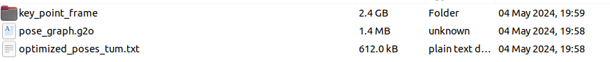
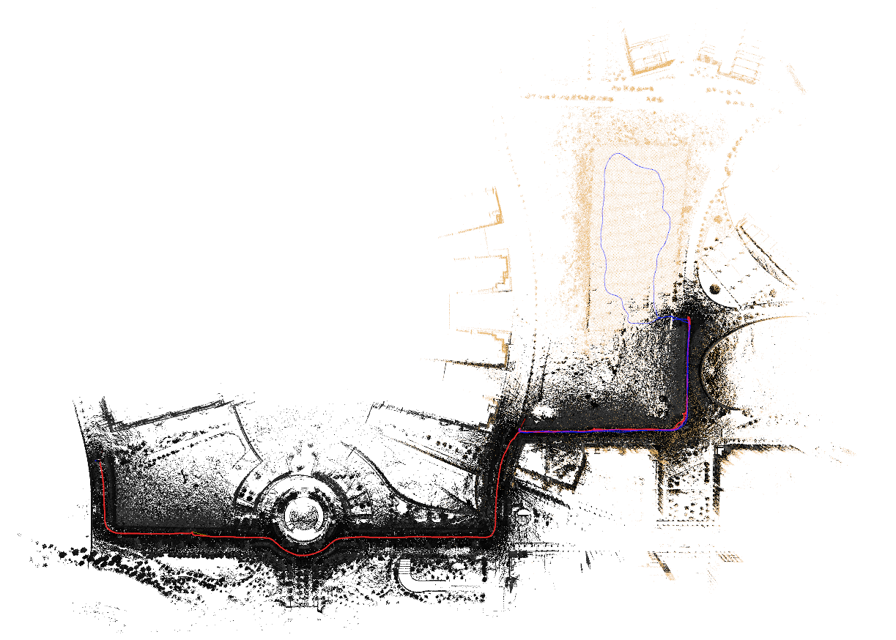
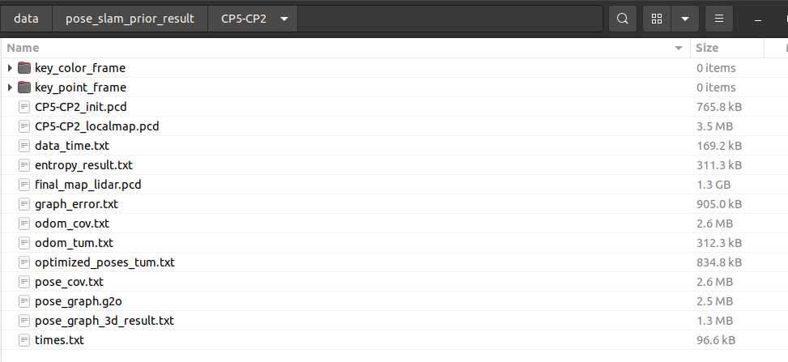
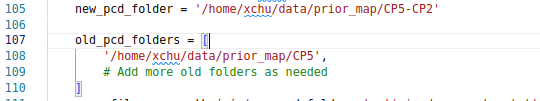
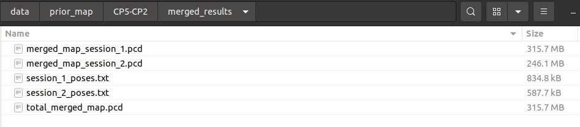
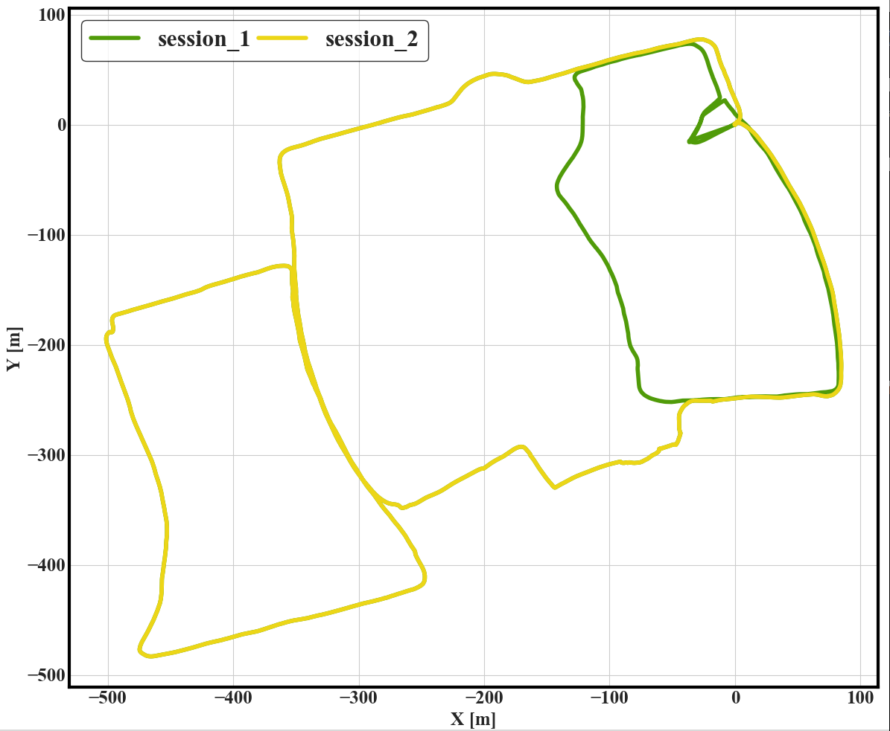
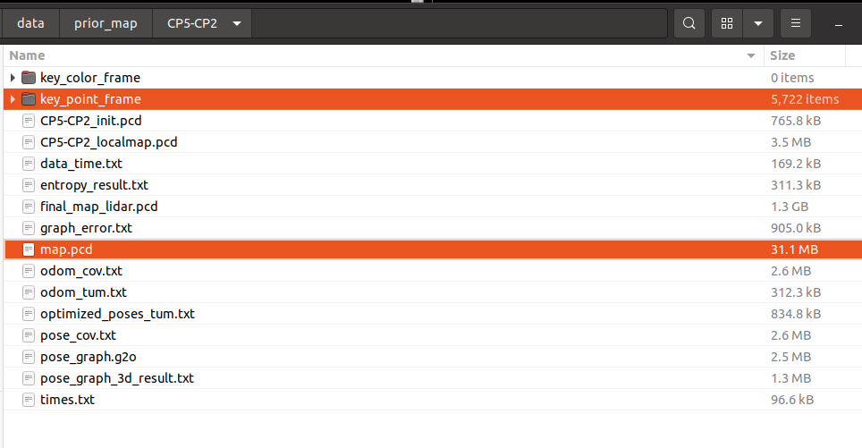
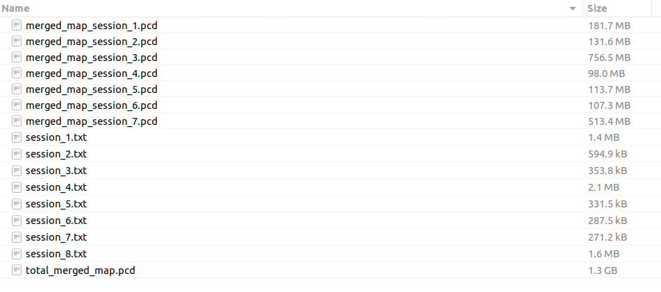
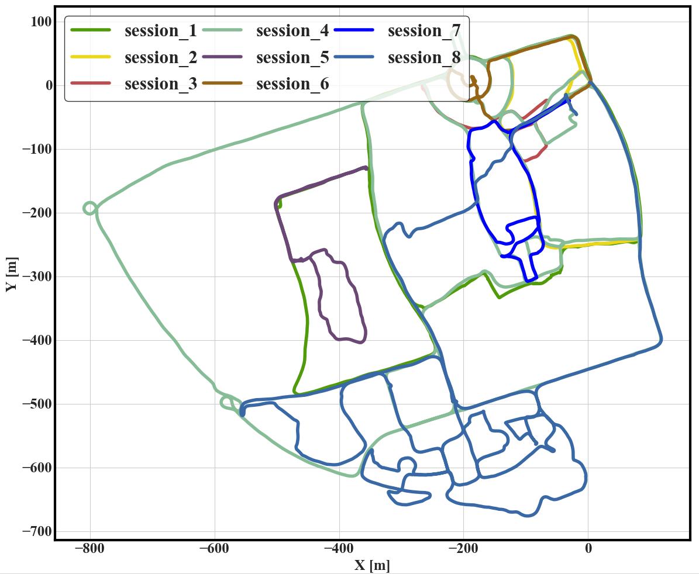

### Baseline: F2F

1. download data. For demo results you can directly download the [old session results](https://hkustconnect-my.sharepoint.com/:u:/g/personal/xhubd_connect_ust_hk/EcoaRBlVdEhMkB4z0jyHkmQBO2feRKSono_fSsVkkCZNOg?e=a8S0SB).

   | [old session bag (`PK1`)](https://ramlab-ust.direct.quickconnect.to:5001/sharing/t9SM1iPZr) | [new session bag (`RB2`)](https://hkustconnect-my.sharepoint.com/personal/xhubd_connect_ust_hk/_layouts/15/onedrive.aspx?id=%2Fpersonal%2Fxhubd%5Fconnect%5Fust%5Fhk%2FDocuments%2Fdataset%2Fpaloc%2FParkinglot%2DRedBird%2D2023%2D10%2D28%2D19%2D09%2D04%2Ezip&parent=%2Fpersonal%2Fxhubd%5Fconnect%5Fust%5Fhk%2FDocuments%2Fdataset%2Fpaloc&ga=1) | [old session results](https://hkustconnect-my.sharepoint.com/:u:/g/personal/xhubd_connect_ust_hk/EcoaRBlVdEhMkB4z0jyHkmQBO2feRKSono_fSsVkkCZNOg?e=a8S0SB) |
   | ------------------------------------------------------------ | ------------------------------------------------------------ | ------------------------------------------------------------ |
   | .png)                    |  |  |

2. set important parameters of file path: `save_directory`, `map_directory`,`bag_path`.

   ```launch
   <param name="save_directory" type="string" value="/home/xchu/data/pose_slam_prior_result/"/>
   <param name="map_directory" type="string" value="/home/xchu/data/prior_map/PK01/"/>
   
   <!--set your data bag path-->
   <arg name="bag_path" default="/media/xchu/新加卷/HKUSTGZ-DATASET/2023-10-28-19-09-04-Parkinglot-RedBird02/Parkinglot-RedBird-2023-10-28-19-09-04.bag"/>
   ```

2. run launch file, blue trajectoty for the old session and red for the new session.

```
roslaunch ms_mapping ms.launch
```



only save data for the new session part, finally use the [python scripts](https://github.com/JokerJohn/SLAMTools/tree/main/Ms_mapping) to get the merged map for analysis.

```
rosservice call /save_map
```


### 8 Sessions Demo Results

Lets take `CP5` as the old session, and use `CP2` to do incremental mapping base on it.

- Build the base map using single-session uncertainty  SLAM. It's important to know the cov of each edge in pose graph. Keyframes number must be the same with the poses number.


- Set the base map as prior map folder, and preparing for the parameters of Ms-Mapping (initial pose). You can use Cloudcompare to align the first point cloud (at the map folder) with the base map to get the initial pose.  (This problem can be solved when you integrate a place recognition algorithm into our system).

  

  


- Run the Ms-Mapping and save the merged data. The keyframe folder  only save the keyframes of the new session data.




- Use the [python scripts](https://github.com/JokerJohn/SLAMTools/tree/main/Ms_mapping) to get and visualize all the session trajectory and session map, together with the merged map.





|  |  |
| ------------------------------------------------------------ | ------------------------------------------------------------ |


- set the new base map `CP5-CP2` for the next mapping round. You need to add the keyframes of `CP5` into this folder. There must be a `map.pcd ` file in the map folder. Check the keyframes number with the pose files.

  

## Example

We provide example merged data for 8 sessions [here](http://gofile.me/4jm56/xNhE1scBX), The session order is: ` CP5-CP2-CS1-CC1-PK1-IA3-IA4-NG`. **One must clean the separate map to remove the point cloud noise caused by the glass**, since this study do not focus on this.  The cleaned map also can be [download here](http://gofile.me/4jm56/jyhJf373S). Note that these example data may be updated since it is not the best results.




[Plot the results](https://github.com/JokerJohn/SLAMTools/tree/main/Ms_mapping):

```python
#trjectory
python3 tum-trajectory-plotter.py 

#map
pcl_viewer merged_map_session_*
```

|  |  |
| ------------------------------------------------------------ | ------------------------------------------------------------ |

